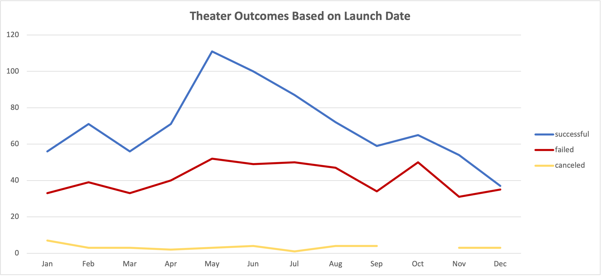
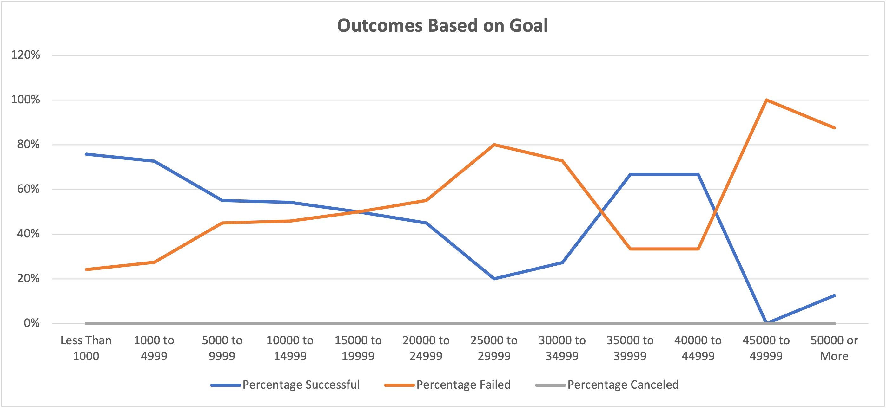

# Kickstarter Outcomes Based on Launch Date and Funding Goals

## Overview of Project

### The purpose of this project is to identify relationships between outcomes of Kickstarter play campaigns and their launch dates and funding goals.  

## Analysis and Challenges

### Analysis of Outcomes Based on Launch Date
I created a pivot table using the Kickstarter dataset to identify trends between campaign outcomes and launch dates.  I used Parent Category and Years as filters, Outcomes as columns, Launch Date as rows, and ID as values.  I adjusted values setting from "Sum" to "Count" for the IDs.  I then used the pivot table to create a line chart to visualize the relationship between outcomes and launch month.
   
   
### Analysis of Outcomes Based on Goals
I used the COUNTIFS function to identify the number of successful, failed, and canceled Kickstarter plays by funding goal range.  I used the "outcome," "goal," and "play" columns in the dataset as filters for the function.  I used the SUM function to create a "Total Projects" count by funding goal range.  I divided the number of successful, failed, and canceled plays by the "Total Projects" count to create percentages.  I then used the percentages to create a line chart to visualize the relationship between outcomes and funding goals.
    

### Challenges and Difficulties Encountered
I did not encounter challenges, but I did anticipate challenges with the COUNTIFS functions used to calculate the number of successful, failed, and canceled Kickstarter plays by funding goal.  The funding goals are easy to either misread or mistype within the function, so I took extra care to triple check my functions before proceeding with my other calculations and analysis.

## Results

- Launch Date - Based on the trends displayed in the data, the month with the highest volume of successful campaigns is May.  The month with the lowest volume of successful campaigns is December.  

- Goals - Based on the trends displayed in the data, $45,000 - $49,999 is the goal range with the lowest successful and highest failed campaigns.  $35,000 - $44,999 is the goals range with the highest successful and lowest failed campaigns.  

- Limitations of the Dataset - This dataset covers campaign results from the years 2009 - 2017.  This means that we are missing campaign data from the past 5 years.  Trends might be different over the past 5 years, considering changes in the global economy and potential impacts on the entertainment industry.

- Additional Tables and Graphs - 
